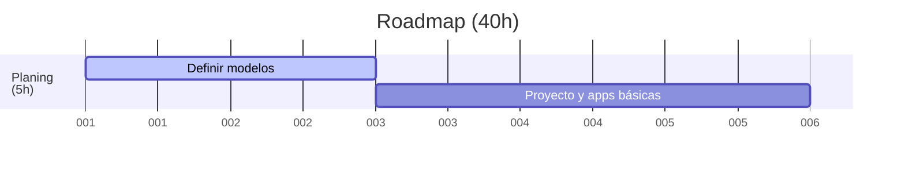

# 🛠️ Planificación y estructura básica del proyecto (4h)

```mermaid
gantt
    title Roadmap (40h)
    dateFormat  DDD
    axisFormat %j

    section Planing<br>(5h)
    Definir modelos             :active, 01-01, 2d
    Proyecto y apps básicas     : 01-03, 3d
```

## Definir modelos en Django
## Crear proyecto y apps básicas
