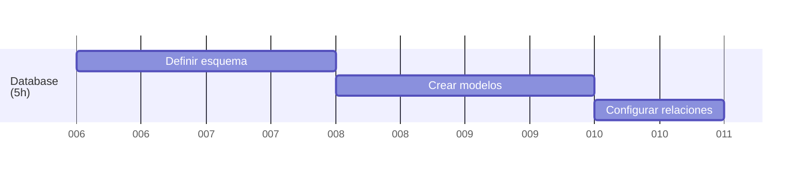

# 🗄️ Diseño de la base de datos (5h)

```mermaid
gantt
    dateFormat  DDD
    axisFormat %j

    section Database<br>(5h)
    Definir esquema             : 01-06, 2d
    Crear modelos               : 01-08, 2d
    Configurar relaciones       : 01-10, 1d
```

## 📋 Definir esquemas de datos

## 🛠️ Crear modelos de datos en Django

## 🔗 Configurar relaciones entre modelos

