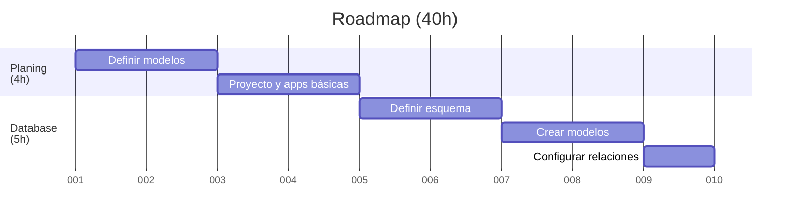
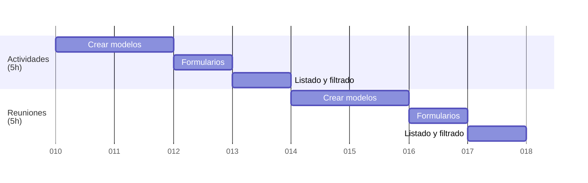
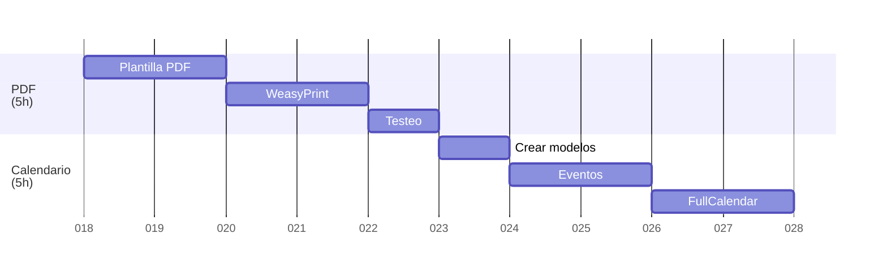
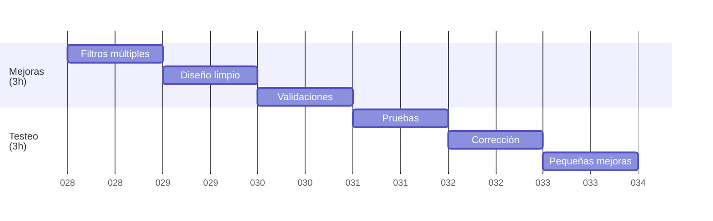
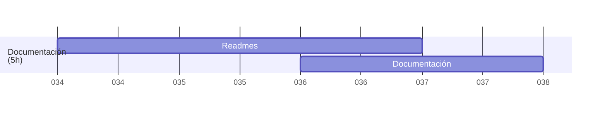

## 🗺️ **Roadmap (40h) – Marzo y Mayo 2025**

| Objetivo principal                           | Horas estimadas | Tareas                                                                 |
|----------------------------------------------|------------------|------------------------------------------------------------------------|
| Planificación Estructura básica del proyecto | 4h               | - Definir modelos en Django - Crear proyecto y apps básicas |
| Diseño de la base de datos                    | 5h               | - Definir esquemas de datos - Crear modelos de datos en Django - Configurar relaciones entre modelos |
| CRUD de Actividades                          | 4h               | - Crear modelos `Actividad` y `ObjetivoPedagogico` - Formularios - Listado y filtrado |
| CRUD de Programaciones                       | 4h               | - Modelo `Programacion` + `ActividadProgramada` - Formularios - Listado y filtrado |
| Generador de PDF                             | 5h               | - Plantilla HTML para PDF - Integrar `WeasyPrint` - Botón de descarga en vista de programación |
| Sistema de calendario   | 5h               | - Modelo `Reunion` - API para eventos - Integrar `FullCalendar` en frontend |
| Mejoras            | 4h               | - Filtros múltiples - Diseño limpio de interfaces - Validaciones |
| Tests y ajustes finales                      | 4h               | - Pruebas básicas - Corrección de errores - Pequeñas mejoras |
| Documentación + Deploy local (opcional)      | 5h               | - README completo - Instrucciones de uso |
| **Total**                                         | **40h**          |                                                                                   |

