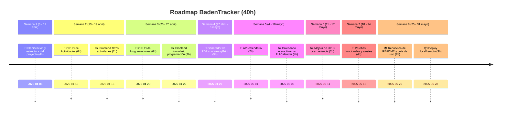

## 🗓️ Roadmap BadenTracker

```mermaid
timeline
    title Roadmap BadenTracker (40h)
    
    section Semana 1 (6 - 12 abril)
    🧠 Planificación y estructura del proyecto (4h): 2025-04-06

    section Semana 2 (13 - 19 abril)
    🧱 CRUD de Actividades (6h): 2025-04-13
    🖼️ Frontend filtros actividades (2h): 2025-04-16

    section Semana 3 (20 - 26 abril)
    🧱 CRUD de Programaciones (6h): 2025-04-20
    🖼️ Frontend formulario programación (2h): 2025-04-22

    section Semana 4 (27 abril - 3 mayo)
    🧱 Generador de PDF con WeasyPrint (5h): 2025-04-27

    section Semana 5 (4 - 10 mayo)
    🧱 API calendario (2h): 2025-05-04
    🖼️ Calendario interactivo con FullCalendar (4h): 2025-05-06

    section Semana 6 (11 - 17 mayo)
    🖼️ Mejora de UI/UX y experiencia (2h): 2025-05-11

    section Semana 7 (18 - 24 mayo)
    🧪 Pruebas funcionales y ajustes (4h): 2025-05-18

    section Semana 8 (25 - 31 mayo)
    📚 Redacción de README y guía de uso (2h): 2025-05-25
    📦 Deploy local/remoto (3h): 2025-05-28

```
