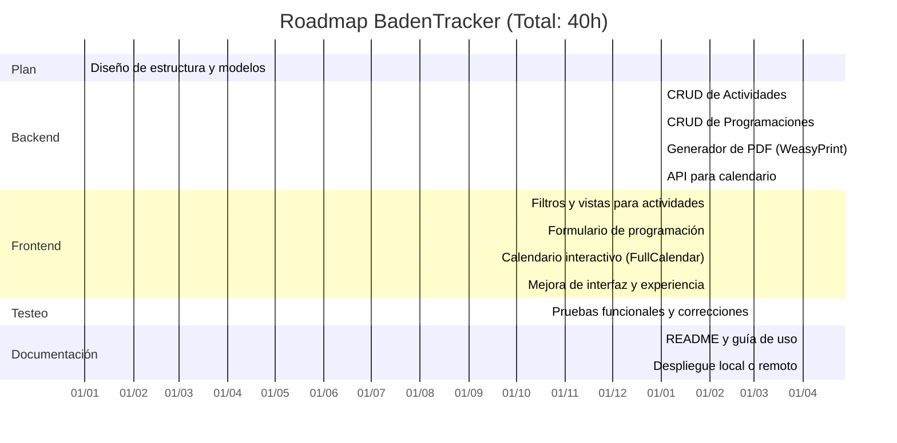

## 🗓️ Roadmap BadenTracker

```mermaid
gantt
    title Roadmap BadenTracker (Total: 40h)
    dateFormat  YYYY-MM-DD
    axisFormat  %d/%m

    section Plan
    Diseño de estructura y modelos         :done, plan1, 0, 4h

    section Backend
    CRUD de Actividades                    :active, back1, 1, 6h
    CRUD de Programaciones                 :back2, 1, 6h
    Generador de PDF (WeasyPrint)         :back3, 1, 5h
    API para calendario                    :back4, 1, 2h

    section Frontend
    Filtros y vistas para actividades      :front1, 2, 2h
    Formulario de programación             :front2, 2, 2h
    Calendario interactivo (FullCalendar) :front3, 2, 4h
    Mejora de interfaz y experiencia       :front4, 2, 2h

    section Testeo
    Pruebas funcionales y correcciones     :test1, 3, 4h

    section Documentación
    README y guía de uso                   :doc1, 4, 2h
    Despliegue local o remoto              :doc2, 4, 3h


```
