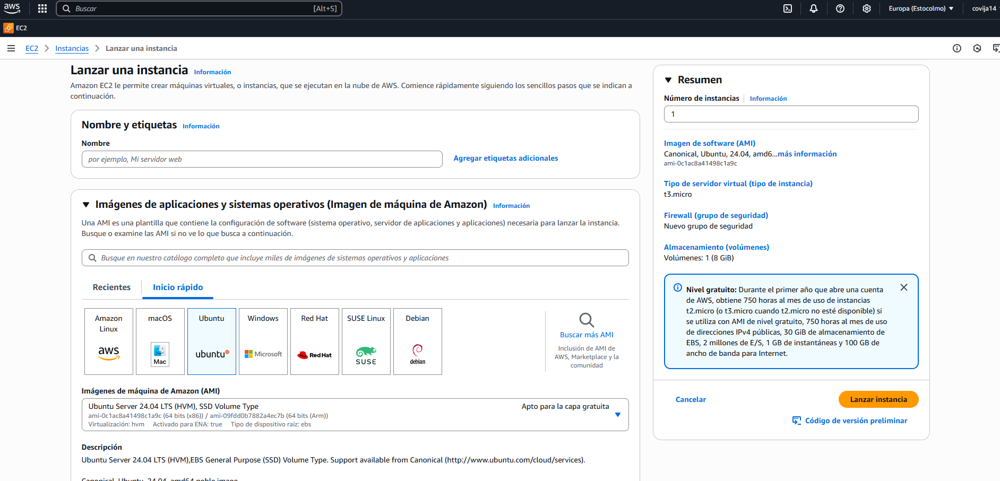

<a href="/.md/readme.md"></a>

# 🖥 Creación y configuración del servidor

> Como servidor en el cual alojar nuestra página web, he decidido usar **AWS**, del cual hemos realizado diferentes prácticas en la asignatura de **SREI**.

Para ello, crearemos un `Servidor Virtual` de Ubuntu Server en `AWS`.

1. Una vez registrado en **AWS**, iremos a `Lanzar la instancia` y crearemos la instancia.

> He decidido usar la capa gratuita que tiene **AWS** ya que no necesitaré muchos mas recursos.

> [!IMPORTANT]  
> Al crear las reglas del grupo de seguridad, añadir como regla de entrada `HTTP`



2. Instalamos `Apache` para poder usar `php` y `sql` en el servidor.

- Actualizamos el servidor

```
sudo apt update && sudo apt upgrade -y
```

- Instalamos Apache

```
sudo apt install apache2 -y
```

- Activamos el servicio `Apache2`

```
sudo systemctl start apache2 && sudo systemctl enable apache2
```

- Instalamos `PHP`

```
sudo add-apt-repository ppa:ondrej/php -y
```

```
sudo apt install php8.4
```

- Instalamos `MySQL` y lo configuramos

```
sudo apt install mysql-server
```

```
sudo mysql_secure_installation
```

  - Creamos la base de datos de `badentracker`

```
CREATE TABLE badentracker;
```

  - Creamos un usuario con permisos para acceder a la base de datos y le damos permisos

```
CREATE USER 'bt'@'localhost' IDENTIFIED by '*******';
```

```
GRANT ALL PRIVILEGES ON badentracker.* TO 'bt'@'localhost';
FLUSH PRIVILEGES;
```

> [!NOTE]  
> Reiniciamos `Apache2`
> ```
> sudo systemctl restart apache2
> ```

1. Añadir archivos al servidor

> Para subir los archivos al servidor, usaremos `git clone` mediante el cual clonaremos el repositorio deseado

```
sudo git clone https://github.com/Covija97/badentracker.git
```

## Recursos

- [Instalación apache](https://www.digitalocean.com/community/tutorials/how-to-install-linux-apache-mysql-php-lamp-stack-on-ubuntu-20-04-es)

- [Instalación PHP](https://www.digitalocean.com/community/tutorials/how-to-install -and-use-php-on-ubuntu-20-04-es)

- [Instalación MySQL](https://www.digitalocean.com/community/tutorials/how-to-install-mysql-on-ubuntu-20-04-es)

- [Cómo crear un nuevo usuario y otorgar permisos en MySQL](https://www.digitalocean.com/community/tutorials/crear-un-nuevo-usuario-y-otorgarle-permisos-en-mysql-es)