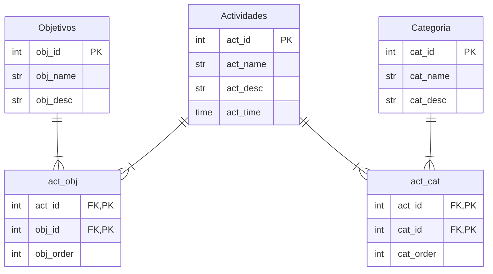

# BadenTracker

> [!NOTE]  
> BadenTracker es una aplicación web diseñada para optimizar la gestión y programación de actividades en grupos scouts.
> 
> La herramienta permitirá a los responsables de grupo organizar reuniones, planificar actividades y documentar programaciones de manera estructurada y accesible.
> 
> A través de un sistema digital centralizado, se busca reducir la dispersión de información y mejorar la planificación del tiempo y los recursos.

## Funcionalidades

- **Gestión de reuniones**: crear, editar y eliminar reuniones con fechas y horarios específicos.
- **Generación de documento pdf**: usando el formato dado, generará un docuemnto pdf de la reunión.
- **Base de datos de actividades**: almacenar actividades con filtro por categorias y objetivos pedagógicos.
- **Calendario**: visualizar las actividades programadas en un calendario.

## Base de datos

```mermaid
erDiagram

Objetivos {
    int obj_id PK
    str obj_name
    str obj_desc
}

act_obj {
    int act_id FK,PK
    int obj_id FK,PK
    int obj_order
}

Actividades {
    int act_id PK
    str act_name
    str act_desc
    time act_time
}

Categoria {
    int cat_id PK
    str cat_name
    str cat_desc
}

act_cat {
    int act_id FK,PK
    int cat_id FK,PK
    int cat_order
}

Actividades ||--|{ act_obj : ""
Actividades ||--|{ act_cat : ""
Objetivos ||--|{ act_obj : ""
Categoria ||--|{ act_cat : ""

```